# Getting Started with NxOS-Armdebug (with Eclipse-Docker Build Environment)
NxOS-Armdebug can be built and run on various OS, due to the use of Docker to manage the build process.
It has been tested on macOS Mojave (10.14.x) Big Sur (11.2.x), and will most likely work on other Linuxes.
It will probably work on recent Windows OS as well, but it has not been tested.
```
For the Windows 10 platform, it is recommended to use the Windows Subsystem for Linux (WSL)
package which provides a propoer Linux (Ubuntu-based) user environment for working with NxOS-Armdebug.
```

## System Requirements
- min dual-core x86 compatible CPU
- min 8 GB RAM (needed to run Docker instance and Eclipse)
- min 8 GB free HD space

## Set up Tools
- install [Docker](https://www.docker.com/)
- install [JDK](https://jdk.java.net/)
- install [Eclipse CDT](https://www.eclipse.org/cdt/)
- install GDB Cross-Debugger (e.g. `arm-none-eabi-gdb`) from [MacPorts](https://www.macports.org/) for macOS, or else some other source for your platform.

```
We will be running ARM Bare-metal applications on the NXT via NxOS-Armdebug. 
Make sure that the version of GNU compiler tools installed is configured as `arm-none-eabi-` versions.
`arm-linux-` or `arm-elf-` versions of the GNU compiler tools will not work.
```
## Install Docker Image

This is best done via the terminal or shell.

- install arm-none-eabi docker image from [Docker Hub](https://hub.docker.com/r/tcwan/arm-none-eabi-gnutools)
(This is based on the official ARM gcc tools release)
```
$ docker pull tcwan/arm-none-eabi-gnutools
```

- tag docker image by listing the available images to get the <image_id>
```
$ docker images
$ docker tag <image_id> arm-eabi
```

- run Docker image as a standalone interactive shell in Linux/macOS to verify proper installation (mapping current directory to /home)
```
$ docker run -it -v$PWD:/home --rm arm-eabi bash
[Inside Docker bash shell]
root@5c3ceeaae138:/work# ls /home
```

## Install Eclipse Plugins
- Install Eclipse Docker Tooling from Eclipse Marketplace

First open the Eclipse Marketplace Window in Eclipse CDT, then select Docker Tooling.

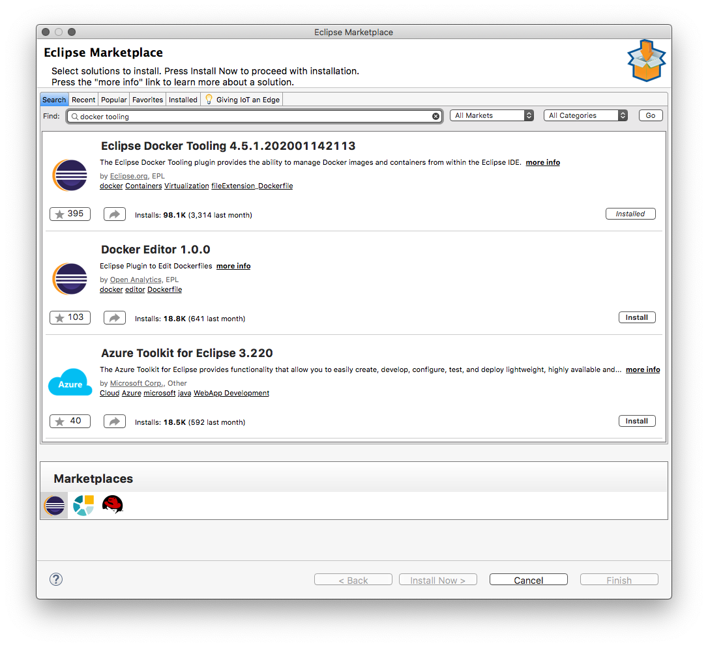

After Installation, add Docker Explorer View by going to "Window->Show View->Other..."

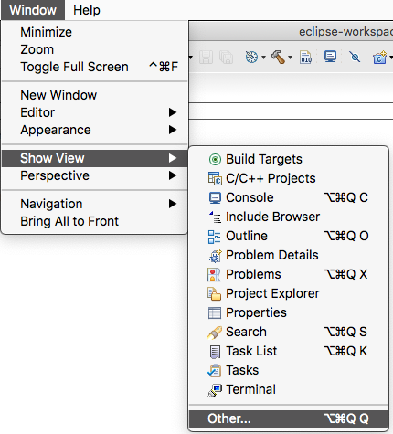

Select Docker Explorer View, and place it in a perspective pane.

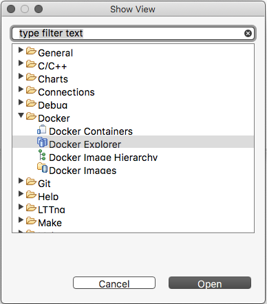

# Obtaining NxOS-Armdebug Source Code

First clone the NxOS-Armdebug project to the local hard drive.

```
$ cd <workspace dir>
$ git clone https://github.com/tcwan/nxos-armdebug.git
```

This will create the NxOS-Armdebug folder as `nxos-armdebug` in the current directory.


# Building NxOS-Armdebug applications

This can be done from the docker container bash shell prompt, or else you can define Build Targets in Eclipse and let Eclipse manage the build.

Note: Internally NxOS-Armdebug uses `scons` to build the actual project code. However, since we're performing the build via Eclipse Docker integration, a top-level `Makefile` is used to dispatch the `scons` build inside the Docker container to enable smoother Eclipse-Docker integration.

## Building NxOS-Armdebug applications via command line

It is possible to build NxOS-Armdebug using natively installed cross-compilation tools, but here we will use the pre-built Docker image for simplicity and consistency.

It is assumed that the Docker volume mounts have been setup properly, and you're in the NxOS-Armdebug directory.

See [docker run](https://linuxize.com/post/docker-run-command/) to understand how to setup the
volume parameter `-v`.
```
$ cd <nxos-armdebug dir>
$ docker run -it -v$PWD:/home --rm arm-eabi bash

[Insider docker image]
# cd /home
/home#
```

- Build the application <app_name> (application folder should be located inside nxos/systems/)
```
/home# make <app_name>
```
- Example: build the application armskel located in nxos/systems/armskel
```
/home# make armskel
```
- Clean all generated code
```
/home# make clean
```

## Building NxOS-Armdebug applications via Eclipse

### Importing NxOS-Armdebug into Eclipse workspace

Make sure that NxOS-Armdebug project has been [cloned](#obtaining-nxos-armdebug-source-code) to the local hard drive.

Then import it into Eclipse using "File->New->Project..."

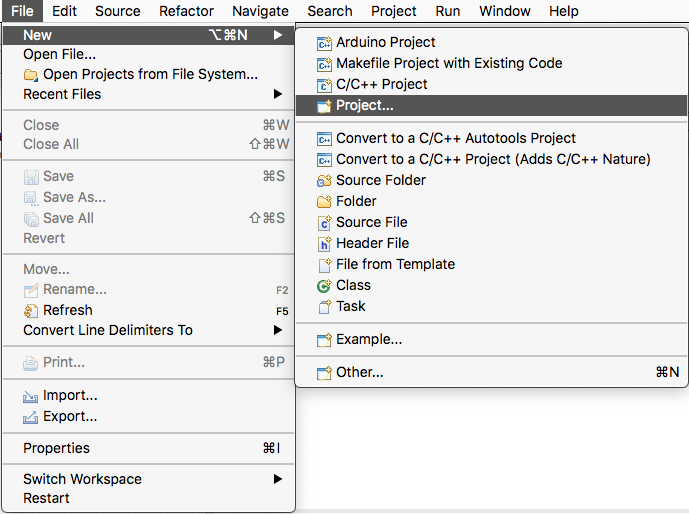

and select "New Makefile Project with Existing Code".


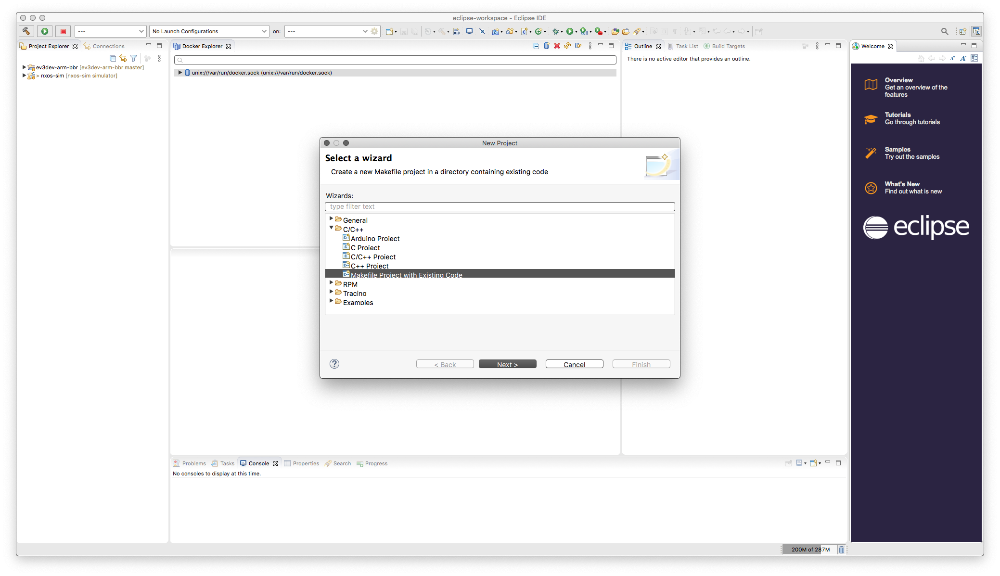

### Setup NxOS-Armdebug to build with Docker

To build NxOS-Armdebug applications using the Docker image, the Project setting must be updated.
Select the Project folder in the "Project Explorer", then choose the "Project->Properties" menu item.

In the Project Properties dialog, select "C/C++ Build->Settings", and click on the "Build Inside Docker Image" checkbox in the Container Settings tab (this should be visible if you've installed the Eclipse Docker Tooling plugin correctly). Don't worry if you don't see the "Toolchains" or "Devices" tab, these are used by the Eclipse Embedded/GNU MCU package, which is not needed for NxOS-Armdebug.


Type the correct image name, either `arm-eabi` if you have tagged the docker image, or else `tcwan/arm-none-eabi-gnutools` for the full image name.

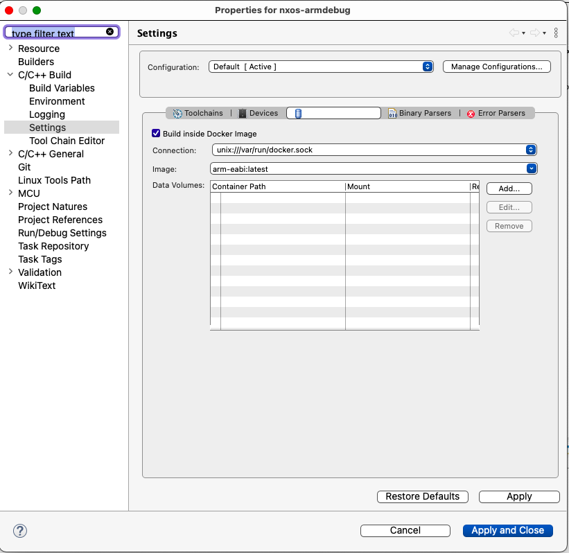


### Building the application

By default Eclipse has a "Project->Build Project" menu item or a Build button which you can select. This will cause the project to perform a build if possible. 

```
Note: Eclipse's "Project->Build Project" menu will execute the last build command
(initially it is `make all`). However, if you've executed "Project->Build Targets"
subsequently, "Project->Build Project" will not work as expected.
```

`make all` will cause `scons` to rebuild the last built application. If no applications were built previously it will build the libraries only.
However, it is not recommended to depend on `make all` for compiling NxOS-Armdebug applications since the outcome is not reliable.

If you select "Project->Clean..." (`make clean`) Eclipse will remove object code and generated output files.

### Defining Specific Build Targets

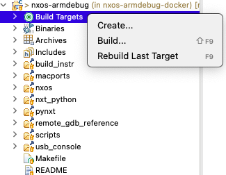


Eclipse provides a quick way to define specific build targets for a project. By right-clicking on the "Build Targets" item in the Project Explorer panel, you can access the "Create..." dialog to define build targets.

You should define build targets for specific applications instead of using the default target `all`. The name of the build target should be: `<app_name>`.
For example, to create a build target for the armskel project, just type `armskel` into the target name field.

# Running and Debugging NxOS-Armdebug application

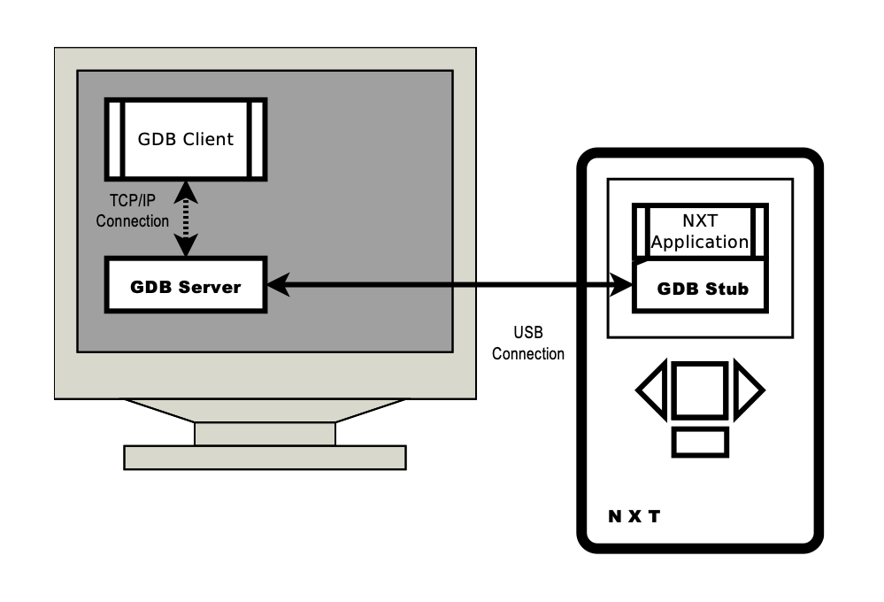

NxOS-Armdebug applications run on the NXT brick. This process is termed cross-debugging, since it involves executing a program compiled on the PC for a device using a different CPU architecture.
Cross-debugging for NXT involves the following steps:
* Establishing communications between the PC and the NXT brick via USB cable
* Downloading applications (*.rxe) into the NXT brick using `nxtfilemgr`
* Configuring software debugging for the GDB server on the PC with the GDB stub on the NXT using `armnxtgdbserver`
* Configuring the Eclipse GDB Client (during initial debugging session)
* Debugging the NXT applicaiton remotely

## Downloading applications into the NXT brick

It is assumed that the build process for the application has completed, and the `<app>.rxe` executable file has been generated successfully.
```
Note: Several binary output files are created in the application project directory:
- <app>.rxe, which is the ARM bare-metal executable for downloading to the NXT brick and executed from RAM
- <app>_rxe.elf, which contains the debug symbols and object code used by the Eclipse debugger

You can ignore the other *.bin and *.elf output files as they're only needed if the application is flashed directly into the NXT Firmware 
(WARNING: Flashing the *.bin application into the NXT will erase the existing NXT firmware).
```

NXT File Manager (`nxtfilemgr`) is a X-Windows based application included with NxOS-Armdebug for downloading the application RXE file into the NXT RAM.
To run `nxtfilemgr`, you will need to have a X-server program on the PC. The Linux GUI Desktop has built-in X-server support. macOS requires the installation of the XQuartz X-server application.
There are X-servers available for Windows platform but it has not been tested with `nxtfilemgr`.

```
$ cd <nxos-armdebug dir>
$ scripts/nxtfilemgr
```
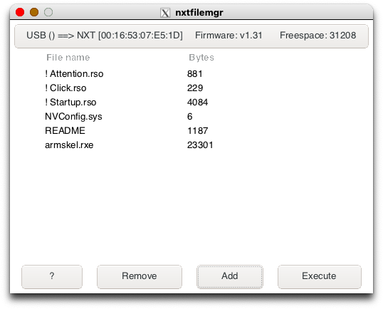


From the NXT File Manager application, you can use the "Add" button to select the `*.rxe` file to be downloaded to the NXT.
Please note that the NXT expects contiguous free space to be available for the file to be downloaded.
If the application states that there is insufficient free space available, you should first select an existing file, and then
press the "Remove" button to delete it, in order to free up contiguous space needed for the new file.

Make sure that the NxOS-Armdebug application is running ("Execute") since the GDB server can only connect to a running NXT application. The GDB server cannot launch any NXT applications remotely.


## Configuring Software Debugging for the GDB Server on the PC

Each NxOS-Armdebug application is embedded with a GDB Stub module during the build. When the `*.rxe` application is executed on the NXT, the GDB stub will wait to receive GDB debugging commands via the USB connection.
The GDB Stub implements the GDB serial debugging protocol on top of the USB bus since the NXT does not come with a default serial port. In order to communicate with the GDB Stub module on the NXT, a GDB server is needed to interface between the GDB Clients and the USB connection.

After making sure that the NXT application is running, the GDB Server `armnxtgdbserver` can then be started.
`armnxtgdbserver` converts GDB serial protocol commands sent via the TCP-based GDB client connections into USB messages needed by the GDB Stub on the NXT and vice-versa.

The GDB Server program is best run in a terminal window via the command line.

```
$ cd <nxos-armdebug dir>
$ scripts/armnxtgdbserver -v

### `-v` is verbose output to help in debugging the GDB Server program

```

In the terminal window, follow the directions given until the prompt:
```
Waiting for GDB connection on port 2828...
```

is displayed. This means that the GDB Server is now ready to accept connections from the GDB Client process.

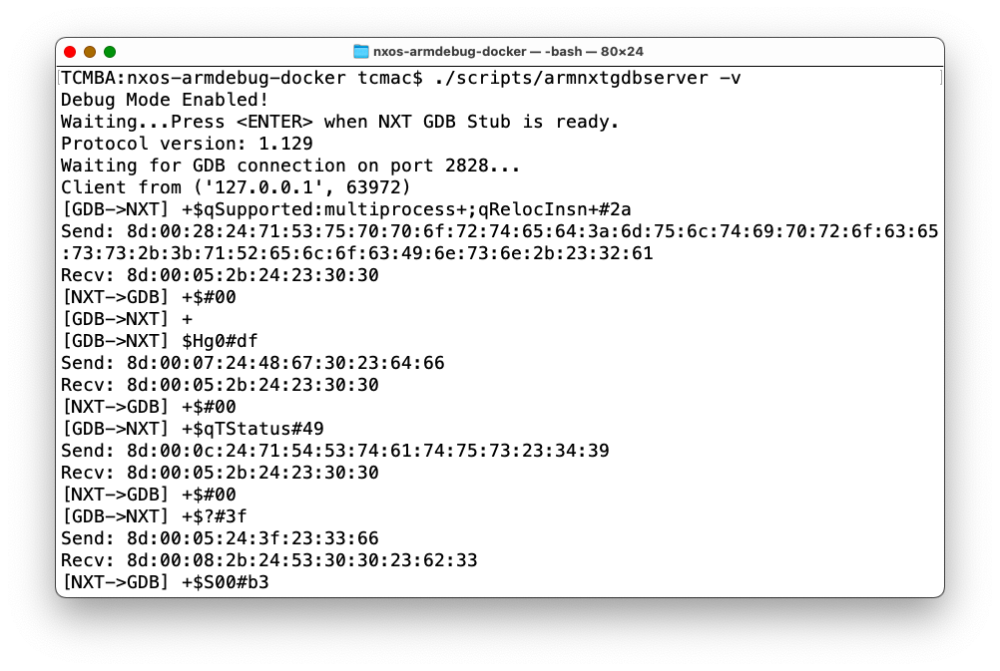


## Configuring the Eclipse GDB Client

The Eclipse IDE has a built-in GDB Client which provides source level cross-platform debugging capabilities.

First, create a new Debug Launch Configuration via the Run Menu "Debug Configurations..." menu item.

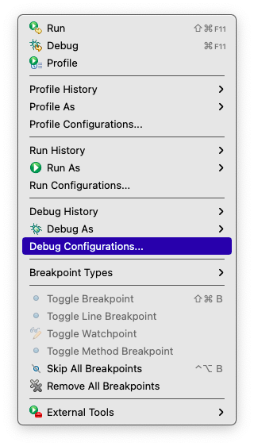

Then, in the Dialog, double-click on the "C/C++ Remote Applicaiton" item in the left panel.

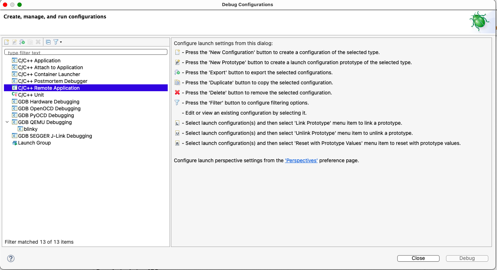

This will create a new Debug Launch Configuration entry, with the corresponding configuration dialog.

Make sure that the Name of the Launch Configuration reflects the application to be debugged.
In addition, the C/C++ Application field *MUST* point to the `<app>_rxe.elf` file for the application.

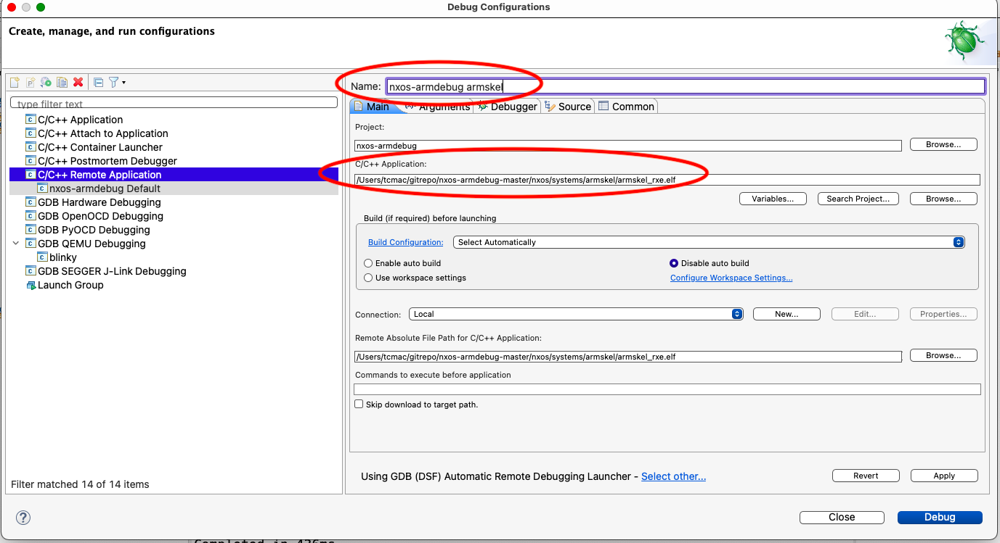

Then, the GDB Remote Debugging Launcher must be changed by clicking on "Select Other..." at the bottom of the dialog.
First, check the "Use Configuration Specific Setting" checkbox, then select the "GDB (DSF) Manual Remote Debugging Launcher" item.

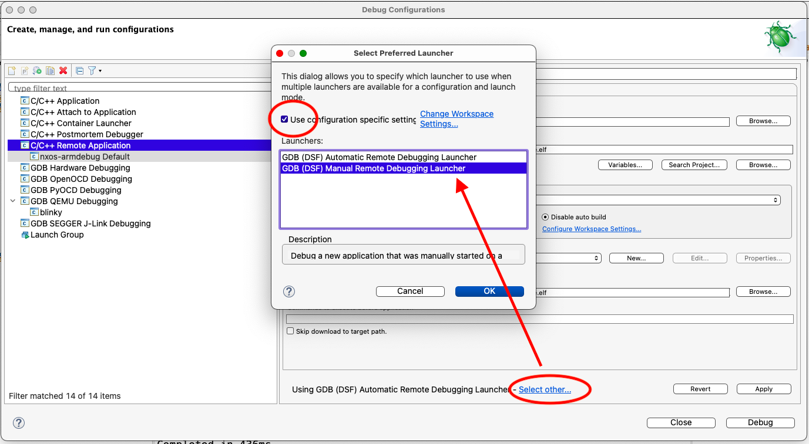

After clicking on "Ok", it will return to the main configuration dialog. We will then configure the "Debugger" tab next.
Change the initial breakpoint given by "Stop on Startup at:" to `break`.


The "Debugger" tab has three sub-tabs. In the "Main" subtab, we need to configure the "GDB Debugger" field to the full path for the cross-platform GDB client which can understand ARM bare-metal executable files.
Generally, this is named `arm-none-eabi-gdb` in MacPorts, as well as most Linux distributions.

```
Generic GDB with multiarch support (which needs to be enabled during tool installation) can be used
but it will need to have the executable target type configured correctly via the command prompt or .gdbinit. 

It is easier to install the `arm-none-eabi-` version instead since everything is pre-configured.
```

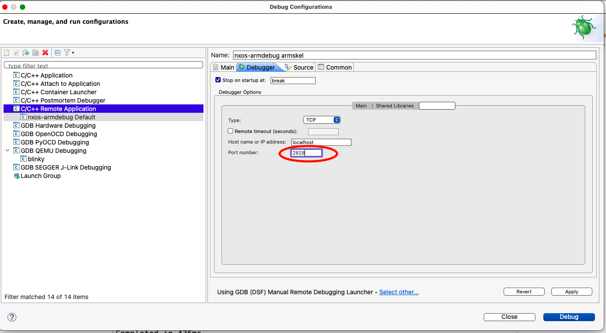

Finally, in the "Connection" subtab, the port should be changed to `2828`.

After all the changes have been made, click "Apply" and "Close" the dialog to save the settings.

## Debugging the NXT application remotely

*Note: Make sure that the NXT application has been [downloaded and running](#downloading-applications-into-the-nxt-brick), and GDBServer is [running](#configuring-software-debugging-for-the-gdb-server-on-the-pc) before invoking the Eclipse Debug Perspective on the PC.*

After the configuration of the Debug Launch Configuration, launch it, and switch over to the Eclipse Debug Perspective. 

Eclipse will display the Debugging window, with the  the process panel and source listing for the main applicaiton. 
Initially, the program will be shown in a running state, since the NXT Debugger will not respond until a command is issued from within the GDB Debugger screen.
Pause the execution of the NXT application using the `Pause` (double vertical bar) button.

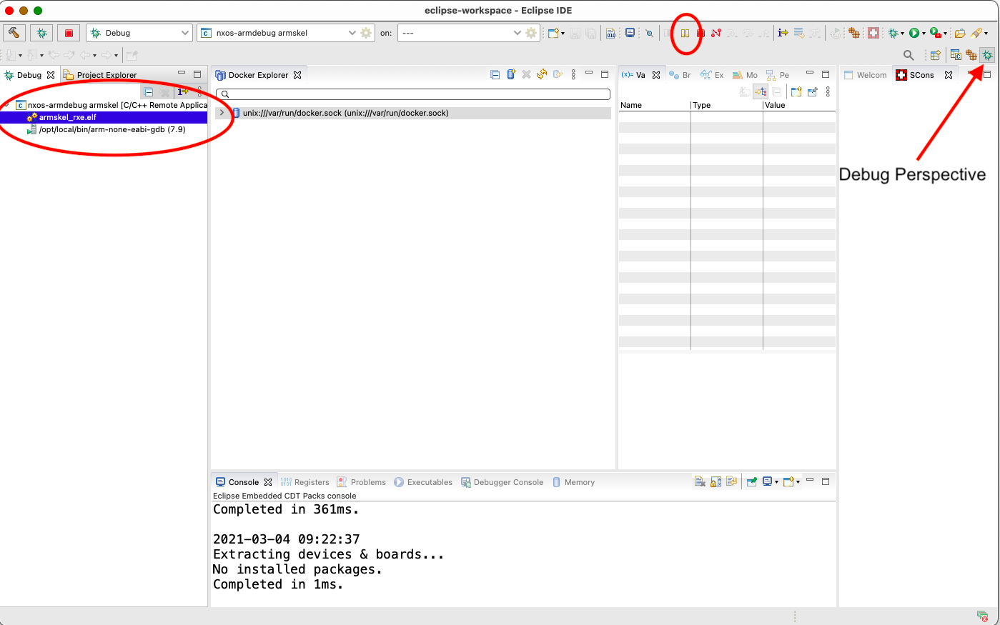

The Debug Perspective will then show which routine the program is currently stopped in, the variables and breakpoints inspection panel, a listing of the current line in the source file, and the console information for GDB.

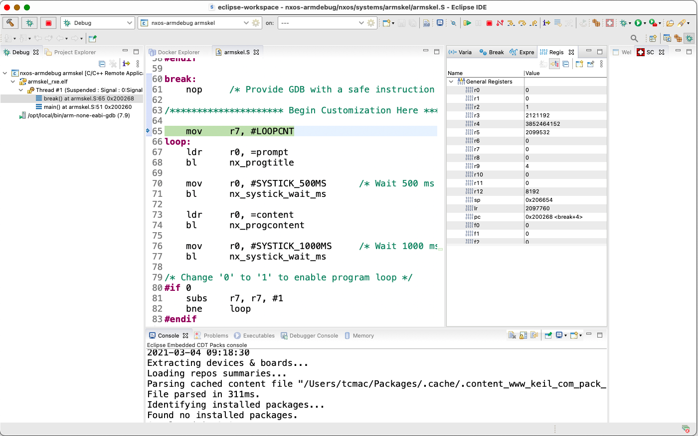

Since the template NxOS-Armdebug program has defined a breakpoint at the label `break`, it should indicate that the application exeuction has stopped at that breakpoint.
In this case, it stopped after executing the instruction at the breakpoint.

The contents of variables and CPU registers can be inspected via the Reister pane. For the NXT, only the CPSR/SPSR and General Purpose Registers (`R0-R15`) are valid.
The Floating-point registers are not found in the ARMv4T CPU used in the NXT and will show dummy content.


If the Register pane is not visible, add it via the "Window" menu, "Show View", "Registers" menu item. 
The pane can be move to the appropriate window group for easy reference (typically in the same window as the "Variables" pane).
Since GDB is primarily a C-based debugger, the variables will not show relevant information for ARM Assembly programs.

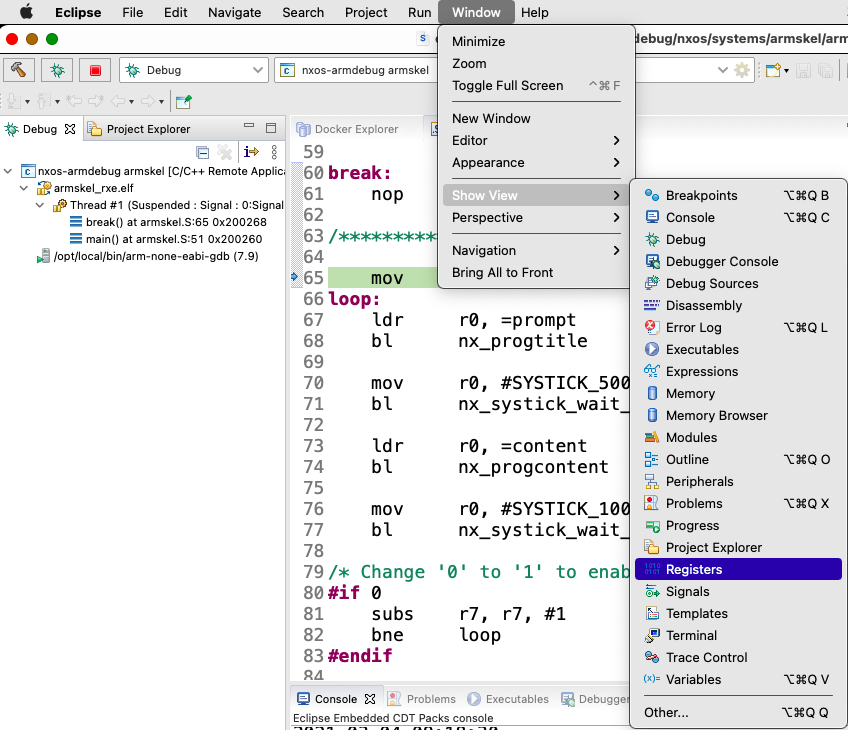

When `Single Step` is pressed, the ARM CPU will execute the next instruction, pause, and display the updated register contents with highlighting.

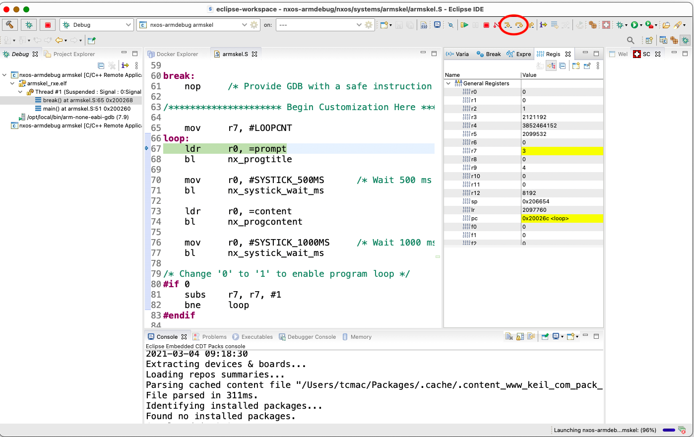

## Setting Breakpoints

The GDB Debugger allows single-stepping and continue. `Single-Stepping` will execute one instruction at a time on the ARM CPU.
`Continue` will resume execution of the program without pausing until the next breakpoint is encountered. 

To set a breakpoint, double-click on the line number column. This will set a `breakpoint` which is indicated by a blue dot.

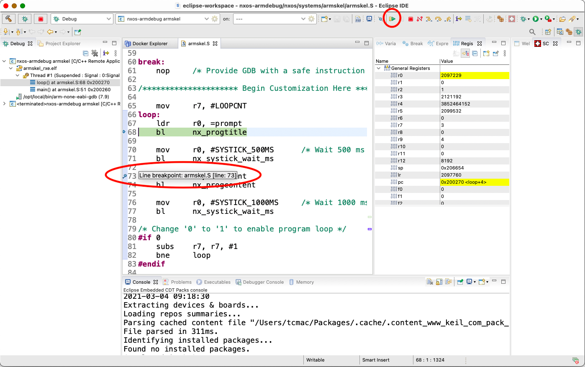

After stopping at a breakpoint, pressing `Continue` will single-step past the current instruction and stop. This is because the Debugger stub needs to update the instruction memory with the original instruction at the previous breakpoint. The Second press of `Continue` will continue execution without stopping.

```
WARNING: Single stepping and breakpoints should not be used inside Interrupt Service Routines 
(Exception Routines) since ARMDebug uses software instructions to implement breakpoints. 

Interrupts are disabled inside Interrupt Service Routines, and ARMDebug would not receive the 
necessary interrupt from the USB bus to exchange data with the PC.
```

